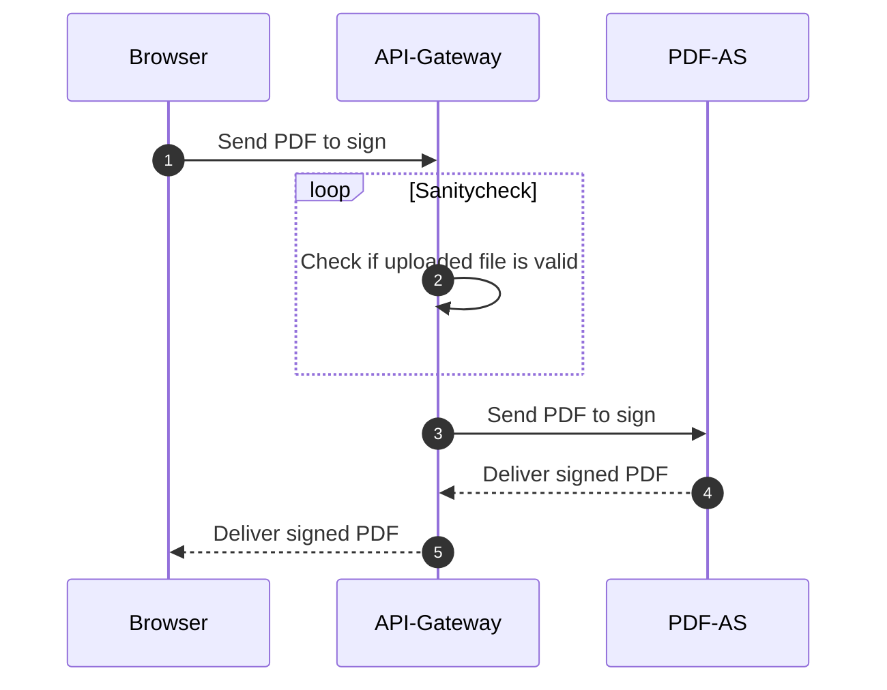

# Advanced Signature Flow

```mermaid
sequenceDiagram
    participant B as Browser
    participant A as API-Gateway
    participant P as PDF-AS
    autonumber
    B->>A: Send PDF to sign
    loop Sanitycheck
        A->>A: Check if uploaded file is valid
    end
    A->>P: Send PDF to sign
    P-->>A: Deliver signed PDF
    A-->>B: Deliver signed PDF
```

