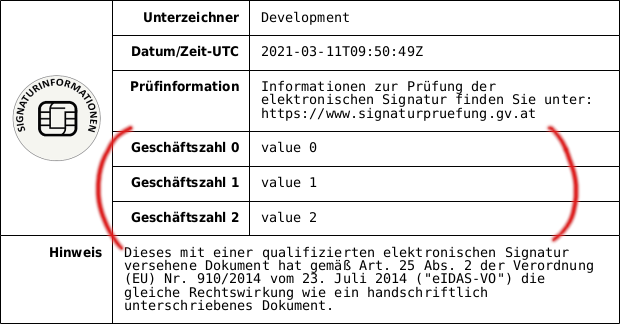

# Configuration

## Bundle Configuration

Create a configuration file under `config/packages` and add the following:

```yaml
dbp_relay_esign:
  qualified_signature:
    server_url: 'https://sig.tugraz.at/pdf-as-web'
    callback_url: 'https://sig.tugraz.at/static/callback.html'
    error_callback_url: 'https://sig.tugraz.at/static/error.html'
    profiles:
      name: default
      profile_id: 'SIGNATURBLOCK_SMALL_DE_NOTE_PDFA'
```

* `qualified_url` - The URL to the pdf-as-web endpoint
* `qualified_static_url` - Endpoint where error.html and callback.html can be accessed
* `profiles` - A list of profiles
    * `name` - The unique identifier that needs to be passed to the signing endpoint via the `profile` parameter.
    * `profile_id` - The profile ID in the pdf-as config
    * `role` - The Symfony role that is required by the user to use this profile
    * `profile_user_text_*` (optional) - see "User Defined Text" below

```yaml
dbp_relay_esign:
  advanced_signature:
    server_url: 'https://pdfas.tugraz.at/pdf-as-web'
    profiles:
      - name: official
        key_id: tugraz-official
        profile_id: SIGNATURBLOCK_TUGRAZ_AMTSSIGNATUR
        role: ROLE_SCOPE_OFFICIAL-SIGNATURE
      - name: sap
        key_id: tugraz-sap
        profile_id: SIGNATURBLOCK_TUGRAZ_SAP
        role: ROLE_SCOPE_CORPORATE-SIGNATURE
```

* `server_url` - The URL to the pdf-as-web endpoint
* `profiles` - A list of profiles
    * `name` - The unique identifier that needs to be passed to the signing endpoint via the `profile` parameter.
    * `key_id` - The key ID in the pdf-as-web keystore list
    * `profile_id` - The profile ID in the pdf-as config
    * `role` - The Symfony role that is required by the user to use this profile
    * `user_text_*` (optional) - see "User Defined Text" below


## User Defined Text

This allows the user of the API to append custom rows to a table in the visible
signature block.

{: style="max-width:400px; width: 100%" }

Both `qualified_profile` as well as every entry in `advanced_profiles` allows
setting an optional user text configuration:


user_text_table: user
user_text_row: 1
user_text_attach_parent: info
user_text_attach_child: user
user_text_attach_row: 2

* `user_text_table` - The profile table ID to attach the content to
* `user_text_row` - The index of the first unset row in the table (starts with 1)
* `user_text_attach_parent`/`user_text_attach_child`/`user_text_attach_row` (optional) - In case there is content to add the `child` will be attached to `parent` at row `row`.

The extra attachment configuration is required because pdf-as-web doesn't allow
reachable empty tables, so we either have to add to existing tables or attach a
new table depending on wether we want to add rows or not. Example:

```yaml
# We attach user text rows to "user" at row 1
# and if there are any rows we attach "user" to "info" at row 2
user_text_table: user
user_text_row: 1
user_text_attach_parent: info
user_text_attach_child: user
user_text_attach_row: 2
```

To allow the esign bundle to add custom text to the signature profiles you need
to whitelist these configuration objects in the `pdf-as-web.properties` file of
`pdf-as-web`:

```ini
allow.ext.overwrite=true
ext.overwrite.wl.01=^sig_obj\\.SIGNATURBLOCK_TUGRAZ_AMTSSIGNATUR\\..*$
ext.overwrite.wl.02=^sig_obj\\.SIGNATURBLOCK_TUGRAZ_SAP\\..*$
```

Note that this allows changing everything regarding the signature profile, so
make sure the SOAP API isn't publicly reachable.

## PDF-AS Configuration

It's recommended to have two separate pdf-as servers for the advanced and
qualified signatures because the advanced signature one can not be public while
the qualified one needs to be accessible from the internet for talking with
handy-signatur.at

### Qualified Server

FIXME: Provide error.html and callback.html for the static endpoint and other unrelated required options

### Advanced Server

FIXME: other unrelated required options

The pdf-as-web service needs to be configured in `pdf-as-web.properties` to contain a keystore list
containing the keys referenced in the bundle config file.

```ini
# Local key store list
ksl.tugraz-official.enabled=true
ksl.tugraz-official.file=/path/to/tomcat/conf/pdf-as/my-pdf-cert.p12
ksl.tugraz-official.type=PKCS12
ksl.tugraz-official.pass=keystore-password
ksl.tugraz-official.key.alias=mycert
ksl.tugraz-official.key.pass=cert-password
```

In addition in the pdf-as configuration (`config.properties`) the referenced profiles need to be defined.
Usually they are defined in extra files under `./profiles` and then included in `config.properties`:

```ini
include.01 = profiles/SIGNATURBLOCK_TUGRAZ_AMTSSIGNATUR.properties
include.02 = profiles/SIGNATURBLOCK_TUGRAZ_SAP.properties
```

The signature property files included need to use the profile key referenced in the bundle config:

```ini
...
sig_obj.SIGNATURBLOCK_TUGRAZ_AMTSSIGNATUR = ...
...
```