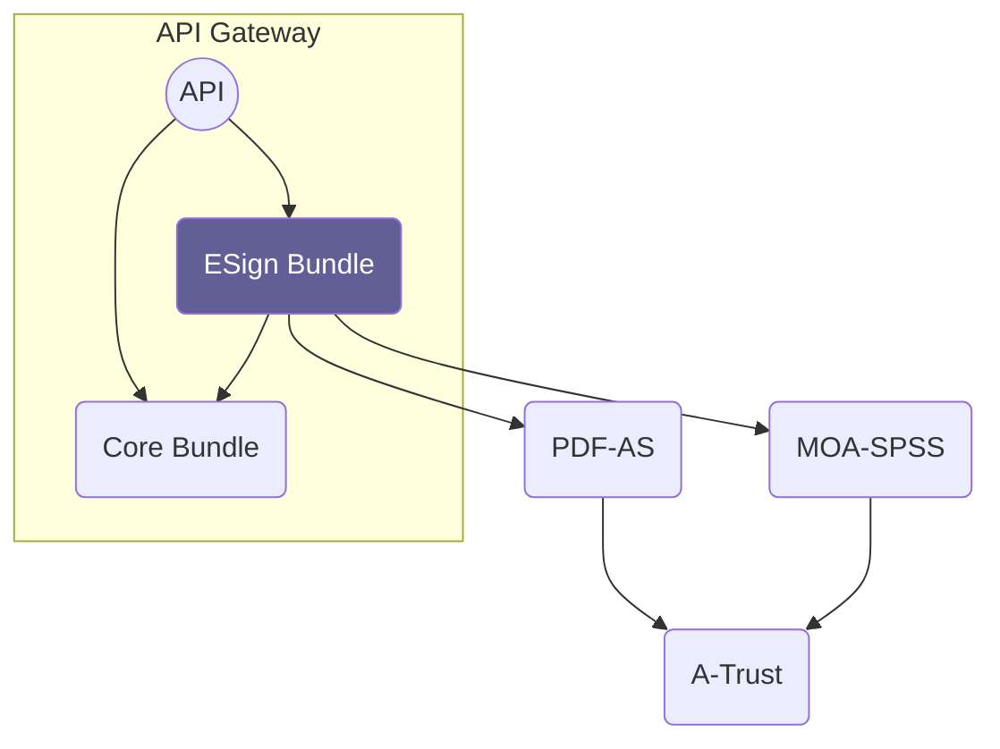
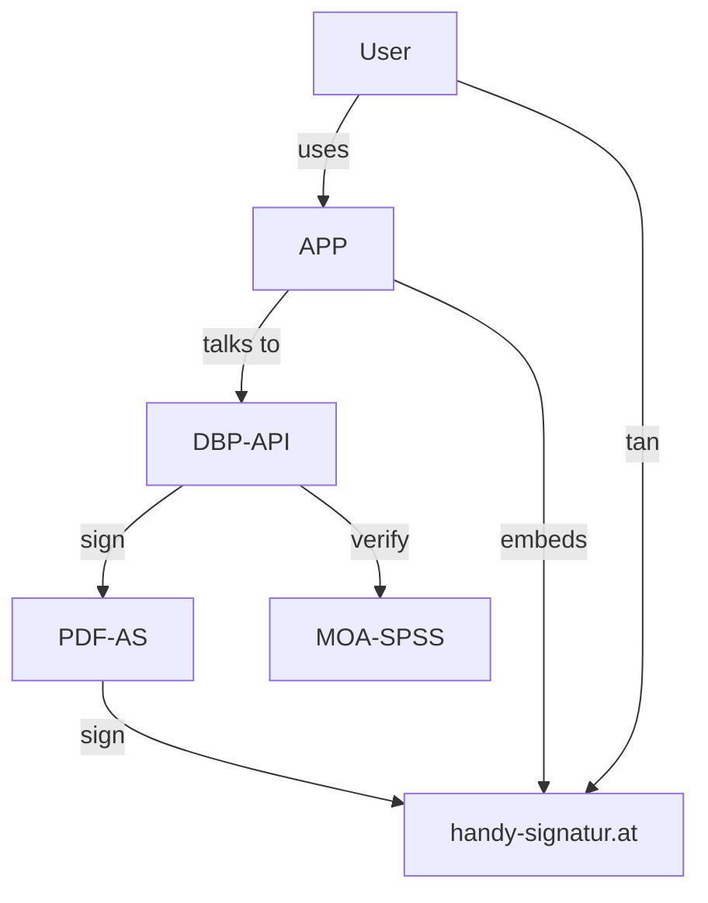

# Overview

The electronic signature bundle provides an API for interacting with multiple [pdf-as](https://www.egiz.gv.at/en/schwerpunkte/16-pdf-as) and [moa-ssp](https://www.egiz.gv.at/en/schwerpunkte/13-moaspssid) servers and allows singing and signature verification of PDF files using [PAdES](https://en.wikipedia.org/wiki/PAdES).

Compared to using PDF-AS/MOA-SPSS directly it adds authentication/authorization
and a simplified REST API for the following three flows:

* Advanced signature flow: Synchronously sign PDF file using certificates on the pdf-as server
* Qualified signature flow: Asynchronously sign a PDF using [handy-signatur.at](https://www.handy-signatur.at)
* (work in progress) Signature verification flow: Verify the integrity and trust chain of a PDF using moa-spss

The following diagram shows the systems involved in signature creation and verification for all provided flows:

### PDF-AS

[PDF-AS](https://www.egiz.gv.at/en/schwerpunkte/16-pdf-as) by [EGIZ](https://www.egiz.gv.at/en/)
is used to sign documents.