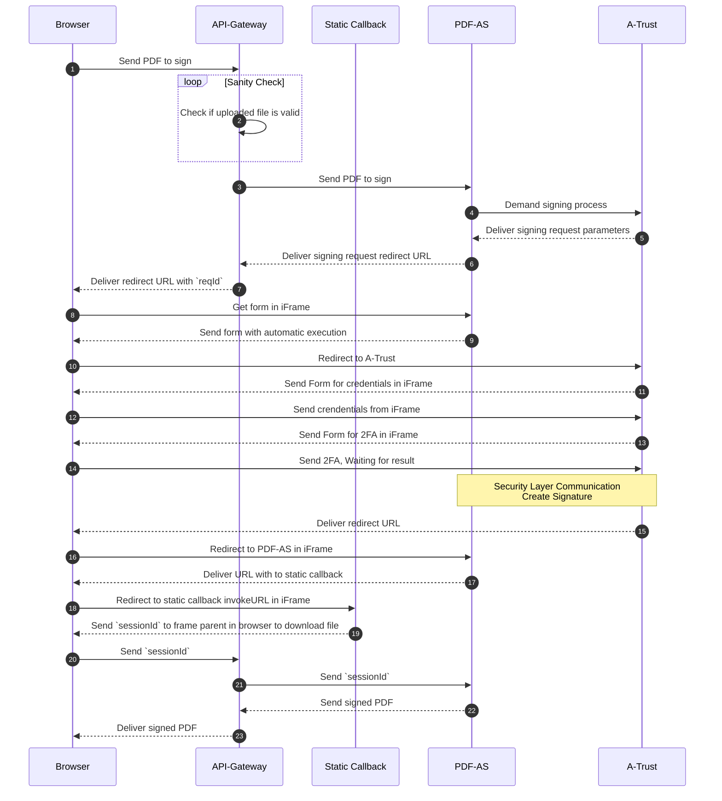
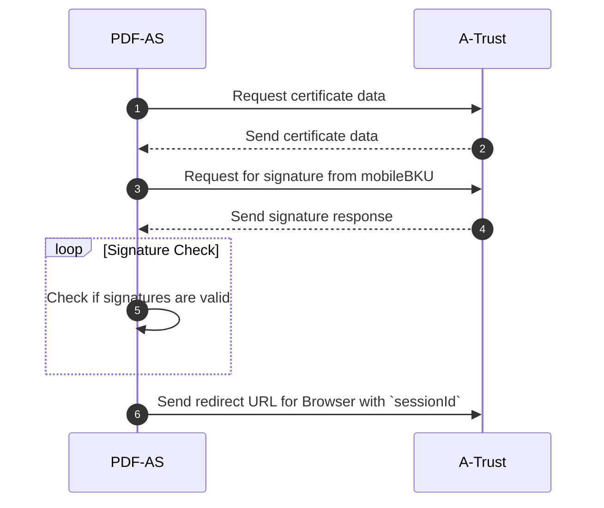

# Qualified Signature Flow

## Browser Interaction

```mermaid
sequenceDiagram
    participant Browser
    participant API as API-Gateway
    participant Callback as Static Callback
    participant PdfAs as PDF-AS
    participant ATrust as A-Trust
    autonumber
    Browser->>API: Send PDF to sign
    loop Sanity Check
        API->>API: Check if uploaded file is valid
    end
    API->>PdfAs: Send PDF to sign
    PdfAs->>ATrust: Demand signing process
    ATrust-->>PdfAs: Deliver signing request parameters
    PdfAs-->>API: Deliver signing request redirect URL
    API-->>Browser: Deliver redirect URL with `reqId`
    Browser->>PdfAs: Get form in iFrame
    PdfAs-->>Browser: Send form with automatic execution
    Browser->>ATrust: Redirect to A-Trust
    ATrust-->>Browser: Send Form for credentials in iFrame
    Browser->>ATrust: Send crendentials from iFrame
    ATrust-->>Browser: Send Form for 2FA in iFrame
    Browser->>ATrust: Send 2FA, Waiting for result
    Note over PdfAs, ATrust: Security Layer Communication<br> Create Signature
    ATrust-->>Browser: Deliver redirect URL
    Browser->>PdfAs: Redirect to PDF-AS in iFrame
    PdfAs-->>Browser: Deliver URL with to static callback
    Browser->>Callback: Redirect to static callback invokeURL in iFrame
    Callback-->>Browser: Send `sessionId` to frame parent in browser to download file
    Browser->>API: Send `sessionId`
    API->>PdfAs: Send `sessionId`
    PdfAs-->>API: Send signed PDF
    API-->>Browser: Deliver signed PDF
```

## Security Layer Communication

```mermaid
sequenceDiagram
    participant PdfAs as PDF-AS
    participant ATrust as A-Trust
    autonumber
    PdfAs->>ATrust: Request certificate data
    ATrust-->>PdfAs: Send certificate data
    PdfAs->>ATrust: Request for signature from mobileBKU
    ATrust-->>PdfAs: Send signature response
    loop Signature Check
        PdfAs->>PdfAs: Check if signatures are valid
    end
    PdfAs->>ATrust: Send redirect URL for Browser with `sessionId`
```
