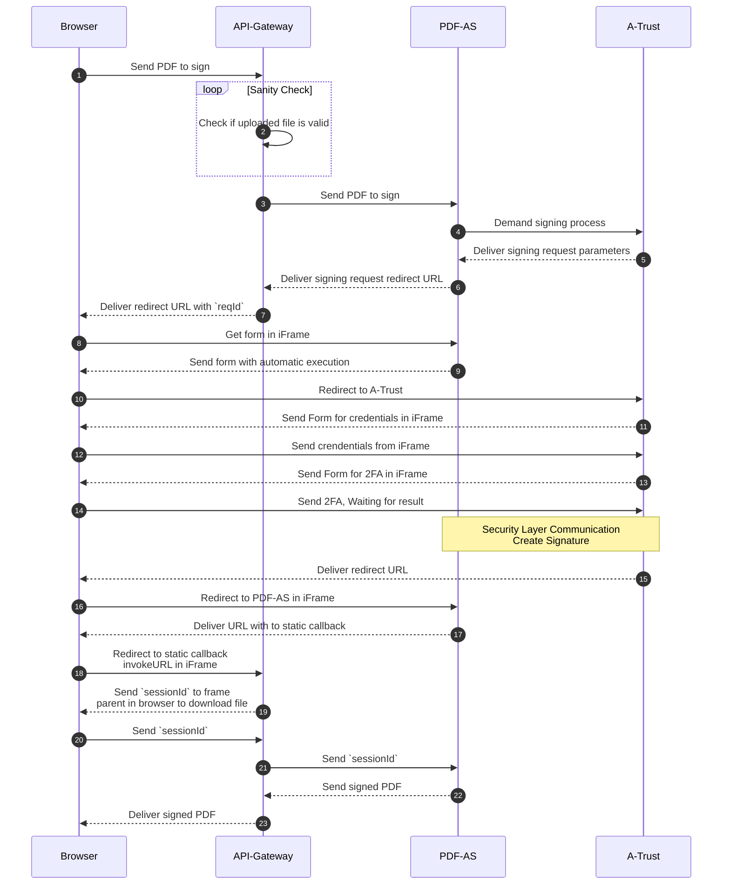
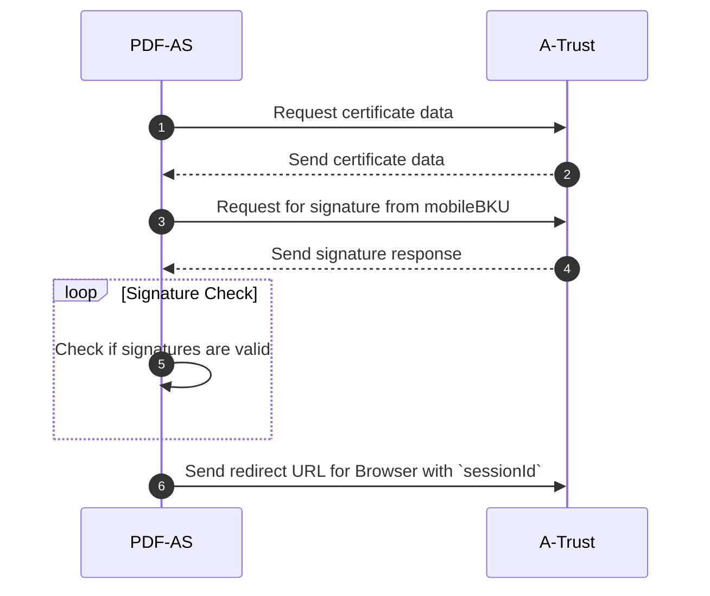

# Qualified Signature Flow

## Browser Interaction


## Security Layer Communication


## Browser Javascript API

The response of calling `/esign/qualified-signing-requests` contains a `url`
property which, in the context of a browser can be loaded in a new windows or an
iframe and will redirect the user to the handy-signatur.at authentication page.
After the authentication is finished the windows will forward a result to the
window creator via the
[postMessage()](https://developer.mozilla.org/en-US/docs/Web/API/Window/postMessage)
API.

In case the authentication succeeded, the response is:

```js
{
    type: 'pdf-as-callback',
    sessionId: '<sessionId>',
}
```

The `sessionId` can be used to retrieve the signed document via the
`/esign/qualifiedly-signed-documents` endpoint.

In case of an error, the response is:

```js
{
    type: 'pdf-as-error',
    error: '<A readable description of the error>',
    cause: '<Cause of the error, usually empty>',
}
```

The `error` property can be shown to the user.
